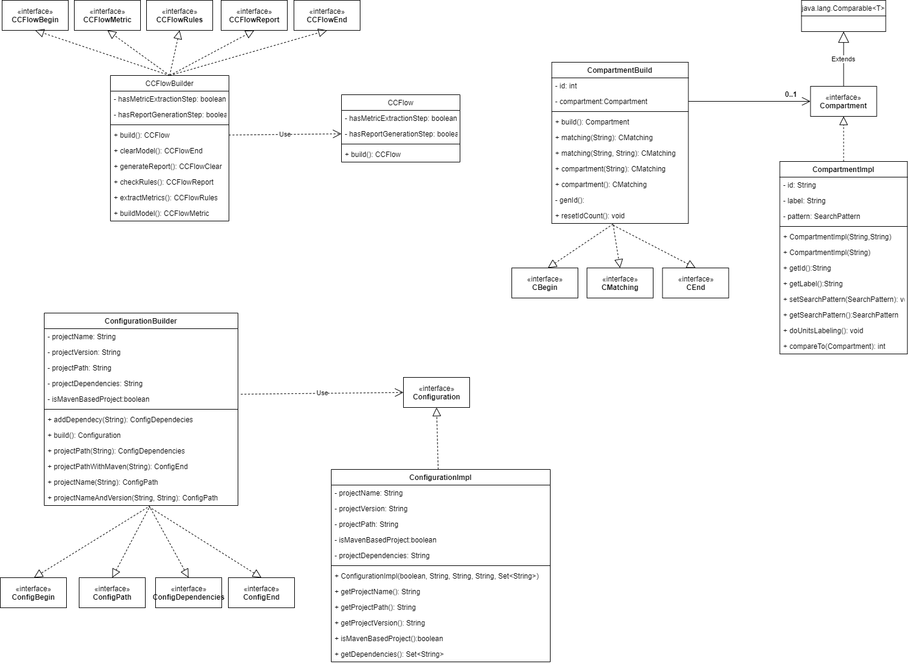
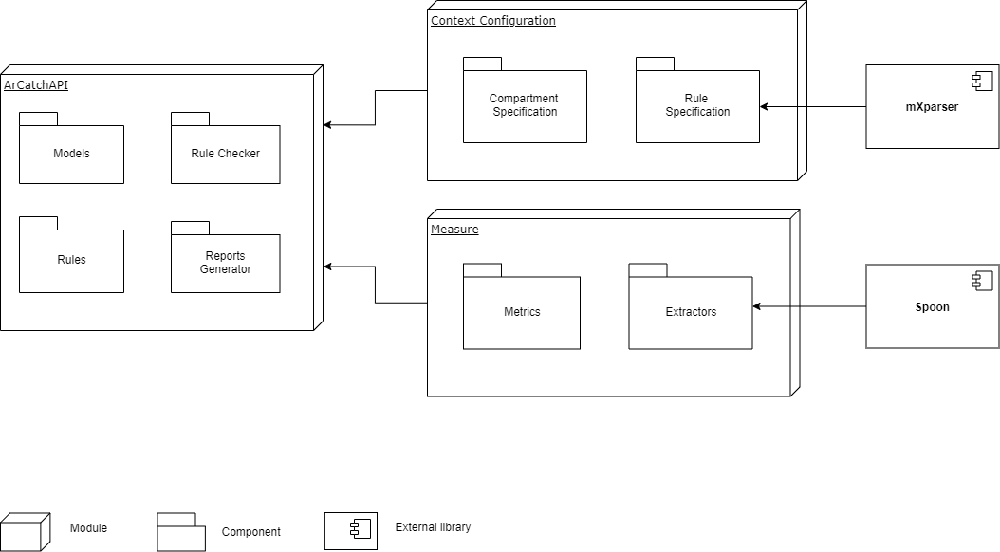

<p align="">
    <a alt="ArCatch">
       
    </a>
    <a alt="Java">
        
    </a>
    <a alt="Spoon">
        
    </a>
</p>

# ArCatch

ArCatch is a tool for static-architecture conformance checking of exception handling design, which deals with the **Exception Handling Degradation** problem. ArCatch is composed of two main parts: 
* A specification language to express architectural elements, map the architectural elements into implementation ones, and define exception handling anti-degradation rules; and 
* A design rule checker to automatically perform the conformance checking and generates conformance reports. 

ArCatch is implemented in Java and its current version provides support only for Java programs.

Architecture drift and erosion are problems in software development. The first one, occurs when the system implements an architecture that is not specified but does not violate project design pretended. The second, on the other hand, is worse because it violates. ArCatch verifies these problems in a target system based on defined rules.

First, we need to do the basic configuration, informing pathing and dependencies. After, defined modules and exceptions as a compartment. The rules are specified using the compartments they can be: Only can, Can only, Cannot and Must the rules have relations that can be 'raise', 'reraise', 'signal', 'handle', 'remap' and 'flow'. The general syntax for the rules are <id> rule <relation> <id> and an optional part ['to' id...]. 

There are some important things to notice, the relations raise, reraise, signal and handle must connect module to exception and the optional part can't be used, the relation remap need the optional part to an exception and the last relation flow connects an exception to an module that will start the flow and can be addressed the optional part to indicate the modules that the expectation can flow.

We can see in the images a class diagram representing the implementation of some class of the dsl folder. In general we have an Builder implementing some interfaces representing an order to build the class. For example, ConfigurationBuilder implements ConfigBegin, ConfigPath, ConfigDependecies and ConfigEnd always returning itself. See, configurationBuilder() from ArCatchAPI return an ConfigBegin calls projectName or projectNameAndVersion returning an ConfigPath and this calls projectPath or projectPathWithMaven and so on. Changing this order can result in problems.




ArCatch in 5 steps
------------------

1. Basic Configuration

    ```java
    ArCatchAPI.setConfiguration(ArCatchAPI
            .configurationBuilder()
            .projectNameAndVersion("FooSys", "1.0")
            .projectPath("<project-src-path>")
            .addDependency("<1st-dependecy-path>")
            .addDependency("<2nd-dependecy-path>")        
            .build());
    ```
    OR

    ```java
    ArCatchAPI.setConfiguration(ArCatchAPI
            .configurationBuilder()
            .projectNameAndVersion("FooSys", "1.0")
            .projectPathWithMaven("<path-to-the-project-pom>")       
            .build());
    ```

2. Compartment Specification
    ```java
    Compartment compA, compB, compE;
    compA = ArCatchAPI
              .compartmentBuilder()
              .compartment("A")
              .matching("foo.a.opt.*")
              .matching("foo.a.util.*")        
              .build();
		    
    ArCatchAPI.addCompartment(compA);		    

    compB = ArCatchAPI
              .compartmentBuilder()
              .compartment("B")
              .matching("foo.b.*")
              .build();
		    
    ArCatchAPI.addCompartment(compB);

    compE = ArCatchAPI
              .compartmentBuilder()
              .compartment("E")
              .matching("foo.exception.*")
              .build();

    ArCatchAPI.addCompartment(compE);;
    ```
3. Anti-Erosion Design Rule Especification
    ```java
    DesignRule AER01, AER02, AER03;

    AER01 = ArCatchAPI
              .ruleBuilder()
              .antiErosion()
              .criticality(Criticality.MEDIUM)
              .only(compB)
              .canSignal(compE)
              .to(compA)
              .build();

    AER02 = ArCatchAPI
              .ruleBuilder()
              .antiErosion()
              .criticality(Criticality.MEDIUM)
              .compartiment(compA)
              .mustHandle(compE)
              .build();

    AER03 = ArCatchAPI
              .ruleBuilder()
              .antiErosion()
              .criticality(Criticality.MEDIUM)
              .compartiment(compA)
              .cannotReraise(compE)
              .build();
    ```
4. Anti-Drift Design Rule Especification
    ```java
    DesignRule ADR01, ADR02, ADR03;

    ADR01 = ArCatchAPI
              .ruleBuilder()
              .antiDrift()
              .criticality(Criticality.WARNING)
              .compartment(compA,compB)
              .constrainedTo("(Ce/(Ce + Ca)) <= 0.3")
              .build());

    ADR02 = ArCatchAPI
              .ruleBuilder()
              .antiDrift()
              .criticality(Criticality.WARNING)
              .compartment(compA,compB)
              .constrainedTo("NoEH > 0.0")
              .build());

    ADR03 = ArCatchAPI
              .ruleBuilder()
              .antiDrift()
              .criticality(Criticality.WARNING)
              .compartment(compA,compB)
              .constrainedTo("NoDR > 0.0")
              .build());
    ```
5. Checking Rules
    ```java
    ArCatchAPI.addRule(AER01)
    ...
    ArCatchAPI.addRule(AER03)
    
    ArCatchAPI.addRule(ADR01)
    ...
    ArCatchAPI.addRule(ADR03)

    ArCatchAPI.check();
    ```

Architecture
------------------

The solution architecture is a product of the quality attributes extracted from the requirements and business rules. The current architectural organization schema looks as follows:

- ArCatchAPI:
    - Exports main methods for tool execution call
        - Generate and export conformance reports
        - Exports methods to add rules
        - Exports methods to add compartments
    - Use pre-defined models that specify operations, positions, units, filters and builders

    - Context Configuration Module:
        - Allow to configure all architectural elements to be considered on conformance checking, 
        - Exports methods to specify dependencies 
        - Add compartments 
        - To specify rules to be applied on project to be evaluated (use [maxParser](http://mathparser.org/) for evaluate some of mathematical expressions)
        
    - Measure Module:
        - Define and storage metric models.
        - Exports extractors to perform metric measurement during conformance checking.
    - Directly import [Spoon](http://spoon.gforge.inria.fr/) to transpile Java source code and generate results for check proccess.

External libraries dependencies:

- [Spoon](http://spoon.gforge.inria.fr/) - Source Code Analysis and Transformation for Java
- [maxParser](http://mathparser.org/) - Math Expressions Parser for Java



Source Code Metrics Supported
-----------------------------

ArCatch extracts ```45``` metrics from a software project's source code under analysis. This set is divided into two subsets of regular and exception handling-related metrics. The regular subset is composed of ```19``` classical metrics (see next). The EH-related subset, is composed of ```26``` metrics. Both sets of metrics (regular and exception handling-related) are used in the specification of anti-drift rules.

1. Classical Metrics

	|Metric      |Meaning                                                 |
	|:-----------|:-------------------------------------------------------|
	|WMC	     |**Weighted Methods per Class**. It counts the number of branch instructions in a class.|
	|DIT	     |**Depth of Inheritance Tree**. It counts the number of "fathers" a class has.|
	|NOC	     |**Number of Children**. It conts the number of immediate sub-classes subordinated to a class in the class hierarchy.|
	|CBO	     |**Coupling Between Objects**. It is a count of the number of non-inheritance related couples with other classes.|
	|RFC         |**Response For Class**. It counts the number of unique method invocations in a class.|
	|LCOM        |**Lack of Cohesion of Methods v1**. It measures the cohesiveness of a class.|
	|LCOM2       |**Lack of Cohesion of Methods v2**. It measures the cohesiveness of a class.|
	|LCOM3       |**Lack of Cohesion of Methods v3**. It measures the cohesiveness of a class.|
	|CCC         |**Class Cyclomatic Complexity**. It counts the  Thomas J. McCabe's cyclomatic complexity of a class.|
	|LoC         |**Lines of Code**. It counts the number of lines of code of a class.|
	|NoI         |**Number of Invovations**. It counts the number of invocations performed by a class.|
	|NoM         |**Number of Methods**. It counts the number of methods of a class.|
	|NoPM        |**Number of Public Methods**. It counts the number of public methods of a class.|
	|NoA         |**Number of Declared Attributes**. It counts the number of declared attributes of a class.|
	|NoPA        |**Number of Public Attributes**. It counts the number of public attributes of a class.|
	|Ca          |**Afferent Coupling**. Is counts how many other classes use the specific class. |
	|Ce          |**Efferent Coupling**. It counts of how many different classes are used by the specific class.|
	|LMLoC       |**Longest Method Lines of Code**. It counts the lines of code of the longest method of a class.|
	|LPL         |**Longest Parameter List**. It counts the number of parameters of the method with the longest parameter list of a class.|

2. Exception Handling Metrics

	|Metric      |Meaning                                                 |
	|:-----------|:-------------------------------------------------------|
	|ECC         |**Exceptional Cyclomatic Complexity**. It counts the sum of cyclomatic complexity inside try, catch, and finally blocks plus the number of throw and methods with throws of a class.|
	|TCC         |**Try Block Cyclomatic Complexity**. It computes the cyclomatic complexity inside a try block of a class.|
	|HCC         |**Catch Block Cyclomatic Complexity**. It computes the cyclomatic complexity inside a catch block of a class.|
	|FCC         |**Finally Block Cyclomatic Complexity**. It computes the cyclomatic complexity inside a finally block of a class.|
	|TFC         |**Troubleness Factor per Class**. It counts the number of methods called by a class that signals an exception back.|
	|TLoC        |**Try Block Lines of Code**. It counts the number of lines of code of all try blocks of a class.|
	|CLoC        |**Catch Block Lines of Code**. It counts the number of lines of code of all catch blocks of a class.|
	|FLoC        |**Finally Block Lines of Code**. It counts the number of lines of code of all finally blocks of a class.|
	|RCo         |**Raising Coupling**. It counts the number of different exceptions types raised (throw) by a class.|
	|SCo         |**Signaling  Coupling**. It counts the number of different exceptions types signaled (throws) by a class.|
	|HCo         |**Handling  Coupling**. It counts the number of different exceptions types handled (catch) by a class.|
	|NoR         |**Number of Raisings**. It counts the number of exceptions raised (throw) by a class.|
	|NoS         |**Number of Signalings**. It counts the number of exceptions signaled (throws) by a class.|
	|NoH         |**Number of Handlings**. It counts the number of exceptions handled (catch) by a class.|
	|NoCRN       |**Number of Catch and Return Null**. It counts the number of handlers that catches an exception an returns null.|
	|NoCA        |**Number of Catch and Abort**. It counts the number of handlers that catches an exception and exits.|
	|NoOC        |**Number of Over-Catches**. It counts the number of handlers that catches multiple exception types.|
	|NoOCA       |**Number of Over-Catches and Abort**. It counts the number of handlers that catches multiple exception types and exits.|
	|NoNPB       |**Number of Nested Protected Blocks**. It counts the number of protected block (try) declared inside an existent protected block.|       
	|NoGH        |**Number of Generic Handlings**. It counts the number of general (```Exception``` or ```Throwable```) exceptions handled by a class.|
	|NoGS        |**Number of Generic Signalings**. It counts the number of general (```Exception``` or ```Throwable```) exceptions signaled by a class.|     
	|NoEH        |**Number of Empty Handlings**. It counts the number of empty catch blocks of a class.|
	|NoDR        |**Number of Destructive Remappings**. It counts the number of exception type remappings that no preserving the exception stack trace.| 
	|NoCI        |**Number of Catch and Ignore**. It counts the number of handlers who catches an exception and do not uses it anymore in the handler block.|
	|NoSF        |**Number of Signalings in Finally Blocks**. It counts the number of exception raisings in cleanup (finally) blocks.|
	|NoSKS       |**Number of Signaling the Kitchen Sink**. It counts the number of signaling methods that signals more then one exception type.|
